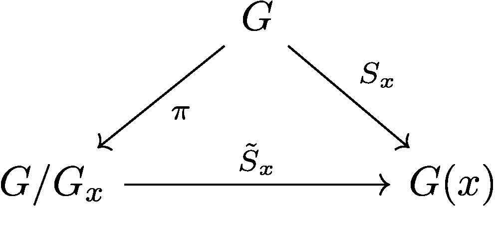

1. [$G$-Actions / $G$-Spaces](#S1)
    1. [The Isotropy Group](#S1s1)
    2. [$G$-Invariance and Fixed Point Sets](#S1s2)
    2. [$G$-Orbits](#S1s3)
    3. [Orbit Type](#S1s4)
    5. [Additional Notation](#S1s5)
2. [Appendix](#SA)
    1. [Conjugacy](#SAs1)

## $G$-Actions / $G$-Spaces 

Throughout this section, we let $G$ denote a compact Lie group with identity $e \in G$.

**Definition:** $G$-Action

The $G$-action on a set $X$ is a map $G \times X \rightarrow X$ defined by 

\begin{eqnarray}
(g,x) \rightarrow gx
\end{eqnarray}
{: style="text-align: center"}

satisfying the following conditions
1. $h(gx) = (hg)x, \; \forall_{h,g \in G} \forall{x \in X}$
2. $ex = x, \; \forall_{x \in X}$

A set, $X$, equipped with a $G$-action is called a **$G$-set**.

In the case that $X$ is a Hausdorff topological space, the $G$-action is a continuous map and $X$ will be called a **$G$-space**.

For the remainder of the section, $X$ will denote a $G$-space.

We now introduce the transformation map $T_g: X \rightarrow X$, induced by the $G$-action on $X$ and the group element $g \in G$, with the definition

\begin{eqnarray}
T_g(x) = gx
\end{eqnarray}
{: style="text-align: center"}

**Lemma:** 

$T: G \rightarrow H(X)$, where $H(X)$ is the space of homeomorphisms from $X$ onto itself.

<i style="font-size:150%;">Proof</i>

Take $g \in G$,
As a consequence of the continuity of the group action, $T_g$ is a continuous map with continuous inverse $(T_g)^{-1} = T_{g^{-1}}$  
Indeed, by conditions $1.$ and $2.)$ of the group action:
- $T_g \circ T_{g^{-1}}(x) = T_{g g^{-1}}(x) = T_{e}(x) = x$

From this persepctive, any $G$-action on $X$ can be understood as the family of homeomorphisms

\begin{eqnarray}
\lbrace T_g: X \rightarrow X \rbrace_{g \in G}
\end{eqnarray}
{: style="text-align: center"}

satisfying conditions equivalent to those of the $G$-action
1. $T_h \circ T_g = T_{hg}, \; \forall_{h,g \in G}$
2. $T_e(x) = x, \; \forall_{x \in X}$

Alternatively, for any $x \in X$, we consider the map $S_x: G \rightarrow X$ defined by 

Alternatively, for any $x \in X$, we consider the **continuous** map $S_x: G \rightarrow X$ defined by 

\begin{eqnarray}
S_x(g) = gx
\end{eqnarray}
{: style="text-align: center"}

Notice that, by continuity of the $G$-action, $S_x$ is continuous $\forall_{x \in X}$

### The Isotropy Group 

**Definition:** Isotropy Group (Stabilizer)

The set of group elements acting trivially on $x \in X$, denoted $G_x$, is the isotropy group of $x$

\begin{eqnarray}
G_x := \lbrace g \in G \; : \; gx = x \rbrace 
\end{eqnarray}
{: style="text-align: center"}

**Lemma:** 

For $x \in X$, $G_x$ is a closed subgroup of $G$

<i style="font-size:150%;">Proof</i>

In order to prove $G_x \leq G$, we must demonstrate the following
1. $g_1, g_2 \in G_x \; \implies \; g_1 g_2 \in G_x$
2. $h \in G_x \; \implies \; h^{-1} \in G_x$

Take $g_1, g_2 \in G_x$, then by condition $1.$ of the group action
- $(g_1 g_2)x = g_1 (g_2 x) = g_1 x = x$

Hence $g_1 g_2 \in G_x$. And, for any $h \in G$ consider condition $2.$ of the group action, from which follows
- $x = (h^{-1} h) x = h^{-1} (h x) = h^{-1} x$

Hence $h^{-1} \in G_x$ and we have $G_x \leq G$

It remains to prove that, $G_x$, in addition to being a subgroup, is closed. Indeed, put

$$
\begin{align}
G_x & := \lbrace g \in G \; : \; gx = x \rbrace \\
 & = \lbrace g \in G \; : \; S_x(g) = x \rbrace \\
 & = S_x^{-1}(x)
\end{align}
$$

As $X$ is in particular Hausdorff, singleton sets are closed and, as the continuous pre-image of a closed set, $G_x$ is therefore closed. 

At this point we introduce some terminology on $G$-actions in relation to the isotropy group.

1. A $G$-action on $X$ is said to be **free** if
    - $\forall_{x \in X} \; G_x = \lbrace {e} \rbrace$
2. A $G$-action on $X$ is said to be **semi-free** if
    - $\forall_{x \in X} \;$ *either*  $G_x = \lbrace {e} \rbrace$ *or* $G_x = G$
3. And, a $G$-action on $X$ is said to be **faithful** if
    - $\forall_{g \in G} \exists_{x \in X} \; gx \neq x$

**Lemma:** 

A $G$-action on $X$ is faithful if and only if

\begin{eqnarray}
\bigcap_{x \in X} G_x = \lbrace e \rbrace
\end{eqnarray}
{: style="text-align: center"}

### $G$-Invariance and Fixed Point Sets 

Let's introduce some convenient notation before we move forward.

1. For $A \subset X$, and for $g \in G$, we put 
    - $gA := \lbrace gx \; : \; x \in A \rbrace = T_g(A)$
2. For $H \leq G$, we put
    - $HA := \bigcup_{g \in H} gA$

**Definition:** $G$-invariance

1. A set $A \subset X$ is called $G$-invariant if 
    - $GA = A$
2. $A$ is said to be $H$-invariant for $H \leq G$ if
    - $HA = A$

For $H \leq G$ a closed subgroup of $G$, consider the following subsets of $X$
1. $X_H := \lbrace x \in X \; : \; G_x = H \rbrace$
2. $X^H := \lbrace x \in X \; : \; G_x \supset H \rbrace$

### $G$-Orbits and $G$-Invariance 

**Definition:** Orbit

The orbit of $x \in X$ is defined

\begin{eqnarray}
G(x) := \lbrace gx  \; : \; g \in G \rbrace 
\end{eqnarray}
{: style="text-align: center"}

It should be clear that, for any $x \in X$, the orbit $G(x)$ is a $G$-invariant subspace of $X$.

**Lemma:** 

$G(x) \subset X$ is compact. 

<i style="font-size:150%;">Proof</i>

Indeed, take $x \in X$, then the orbit can be equivalently defined as the image of the action-map $S_x: G \rightarrow X$

\begin{eqnarray}
G(x) = S_x(G)
\end{eqnarray}
{: style="text-align: center"}

Therefore, $G(x)$ is compact as the continuous image of a compact space.

Denote by $X/G$ the set of all orbits in $X$. 

\begin{eqnarray}
X/G := \lbrace G(x) \; : \; x \in X \rbrace
\end{eqnarray}
{: style="text-align: center"}

It will be shown that $X/G$ forms a partition on the space $X$ and, as such, defines an equivalence relation. Therefore, $X/G$ is in particular a quotient space, which we name the **orbit space** of $X$. When equipped with the canonical projection $\pi: X \rightarrow X/G$, given by $\pi(x) = G(x)$, the orbit space is endowed with a well-defined quotient topology.

**Lemma:** 

$X/G$ forms a partition on $X$.

<i style="font-size:150%;">Proof</i>

We must demonstrate that, for any $x,y \in X$, *either* $G(x) = G(y)$ *or* $G(x) \cap G(y) = \emptyset$. In fact, it is sufficient to show that
- $G(x) \cap G(y) \neq \emptyset \implies G(x) = G(y)$

Indeed, suppose $G(x) \cap G(y) \neq \emptyset$, then there must exist some group elements $g_1,g_2 \in G$ such that $g_1 x = g_2 y$

Now, for any $h \in G$
- $h x = (h g_1^{-1} g_1) x = (h g_1^{-1}) g_1 x = (h g_1^{-1} g_2) y $

Such that $G(x) \subset G(y)$, we can deduce by identical argument that $G(y) \subset G(x)$

### Orbit Type 

For $x \in X$, denote by $G/G_x$ the set of left cosets of the isotropy group $G_x$

\begin{eqnarray}
G/G_x := \lbrace g G_x \; : \; g \in G \rbrace
\end{eqnarray}
{: style="text-align: center"}

**Theorem:** Orbit Stabilizer Theorem

Let $x \in X$, the orbit $G(x)$ is homeomorphic to $G/G_x$.

<i style="font-size:150%;">Proof</i>

Choose $x \in X$ and consider the following diagram

 <figure>
          <label for="figure-2" class="margin-toggle">&#8853;</label><input type="checkbox" id="figure-2" class="margin-toggle"/>Diagram.
          
</figure>

where $\pi: G \rightarrow G/G_x$ is the projection $\pi(g) = gG_x$  

and $\tilde{S}_x: G/G_x \rightarrow G(X)$ is the map $\tilde{S}_x(g G_x) = S_x(g) = gx$  

$\tilde{S}_x$ is our homeomorphism

**proof incomplete**

We denote by, $X/G$, the set of all orbits in $X$, i.e.

\begin{eqnarray}
X/G := \lbrace G(x) \; : \; x \in X \rbrace
\end{eqnarray}
{: style="text-align: center"}

When equipped with the quotient topology induced by the natural projection $\rho: X \rightarrow X/G$, $\rho(x) = G(x)$, $X/G$ will be called the orbit space.

**Lemma:** 

The isotropy groups of points belonging to same orbit, $x,gx \in X$ are conjugate by the group element $g \in G$, i.e.

\begin{eqnarray}
G_{gx} := g G_x g^{-1}
\end{eqnarray}
{: style="text-align: center"}

<i style="font-size:150%;">Proof</i>

$$
{\Large
\begin{align}
G_{gx} & := \lbrace h \in G \; : \; h(gx) = gx \rbrace \\
 & = \lbrace h \in G \; : \; g^{-1}h(gx) = g^{-1}gx \rbrace \\
 & = \lbrace h \in G \; : \; g^{-1}hg \in G_x \rbrace \\
 & = \lbrace h \in G \; : \; h \in g G_x g^{-1} \rbrace \\
 & = g G_x g^{-1}
\end{align}
}%

$$

**Definition:** Orbit Type

For $x \in X$, we will call the conjugacy class, $(G_x)$, the orbit type of $x$

\begin{eqnarray}
(G_{x}) := \lbrace G_{y} \; : \; y \in X, \exists_{h \in G} hG_{y}h^{-1} = G_x \rbrace
\end{eqnarray}
{: style="text-align: center"}

**Definition:** The Weyl Group

Denote by $N(H)$ the normalizer of $H \leq G$. The Weyl group, $W(H)$ is defined

\begin{eqnarray}
W(H):= \frac{N(H)}{H}
\end{eqnarray}
{: style="text-align: center"}

We introduce the following notions
1. Denote by, $\Phi(G)$, the set of all conjugacy classes of closed subgroups in $G$
    - $\Phi(G) = \lbrace (H) \; H \leq G \rbrace$
2. For $k = 0,1, \ldots, dim(G)$, we put
    - $\Phi_k(G) = \lbrace (H) \in \Phi(G) \; : \; \dim{W(H)}  = k \rbrace$
3. And allow $Phi(G;X)$ to denote the set of all orbit types in $X$
    - $\Phi(G;X) = \lbrace (G_x) \in \Phi(G) \; : \; x \in X \rbrace$

Notice that $\Phi(G)$ has a partial order, $\leq$, given by: for $(H),(K) \in \Phi(G)$  

\begin{eqnarray}
(K) \leq (H) \iff \exists_{g \in G} gKg^{-1} \leq H
\end{eqnarray}
{: style="text-align: center"}

We also, observe 

\begin{eqnarray}
\Phi(G) = \bigcup_{k=0}^{n} \Phi_k(G)
\end{eqnarray}
{: style="text-align: center"}

### Cardinal Numbers 

Suppose $L \leq H \leq G$, we put
\begin{eqnarray}
N(L,H):= \lbrace g \in G \; : \; g L g^{-1} \leq H \rbrace
\end{eqnarray}
{: style="text-align: center"}

In general, $N(L,H)$ is *not* a subgroup of $G$. 

**Lemma:** 

$N(L,H) \subset G$ is closed.

<i style="font-size:150%;">Proof</i>

**Lemma:** 

$N(L,H)$ is $N(H)$-invariant.

<i style="font-size:150%;">Proof</i>

We must demonstrate that $\forall_{h \in N(H)} \; hN(L,H) = N(L,H)$  
Choose $g \in N(L,H)$, then $gLg^{-1} \leq H$  
Consider

### Additional Notation & Properties of $G$-spaces 

For $H \leq G$ a closed subgroup of $G$, consider the following subsets of $X$
1. $X_H := \lbrace x \in X \; : \; G_x = H \rbrace$
2. $X^H := \lbrace x \in X \; : \; G_x \supset H \rbrace$
3. $X_{(H)} := \lbrace x \in X \; : \; (G_x) = (H) \rbrace$
4. $X^{(H)} := \lbrace x \in X \; : \; (G_x) \geq (H) \rbrace$

# Appendix 

## Conjugacy 

In this section, let $G$ be any group.

**Definition:** Conjugacy of Subgroups

Two subgroups, $H \leq G$ and $K \leq G$, are said to be conjugate, denoted $H \sim K$ if and only if $\exists_{g \in G}$ such that $gHg^{-1} = K$

We denote by $(H)$ the conjugacy class of $H \leq G$

\begin{eqnarray}
(H) &:= \lbrace K \leq G \; : \; H \sim K \rbrace
\end{eqnarray}
{: style="text-align: center"}

Notice that conjugacy is an equivalence relation on the space of subgroups of $G$. We put

\begin{eqnarray}
\Phi(G) &:= \lbrace (H) \; : \; H \leq G \rbrace
\end{eqnarray}
{: style="text-align: center"}

**Definition:** Normality

A subgroup H is said to be normal in $G$, denoted $H \mathrel{\unlhd} G$, if and only if $\forall_{g \in G} gHg^{-1} = H$

In the context of the conjugacy relation we propose the following lemma.

**Lemma:** 

$H \mathrel{\unlhd} G$ if and only if $H \sim K \implies K = G$

We might also consider the conjugacy of group elements. Denote the conjugacy of $h \in G$ with

\begin{eqnarray}
Cl_{G}(h) &:= \lbrace ghg^{-1} \; : \; g \in G \rbrace
\end{eqnarray}
{: style="text-align: center"}

Recall, the center of $G$ is the set

\begin{eqnarray}
Z(G) &:= \lbrace h \in G \; : \; gh=hg \; \forall_{g \in G} \rbrace
\end{eqnarray}
{: style="text-align: center"}

**Lemma:** 

$Cl_{G}(h) = \lbrace h \rbrace$ if and only if $h \in Z(g)$

**Remark:** If $G$ is abelian, then $G = Z(G)$ such that $Cl_{G}(g) = \lbrace g \rbrace$ $\forall_{g \in G}$

**Proposition:** 

A normal subgroup, $H \mathrel{\unlhd} G$, is the union of its conjugacy classes.

<i style="font-size:150%;">Proof</i>

Take $h \in H$. As $H$ is normal
- $\for_{g \in G} ghg^{-1} \in H$

hence, $Cl_{G}(h) \subset H$. The other inclusion is immediate.

Let $H \leq G$, the centralizer of $H$ is the subgroup

\begin{eqnarray}
C_{G}(H) &:= \lbrace g \in G \; : \; ghg^{-1} = h \; \forall_{h \in H} \rbrace
\end{eqnarray}
{: style="text-align: center"}

Likewise, the centralizer of a group element $h \in G$ is the subgroup

\begin{eqnarray}
C_{G}(h) &:= \lbrace g \in G \; : \; ghg^{-1} = h \rbrace
\end{eqnarray}
{: style="text-align: center"}

Finally, we introduce the normalizer of $H \leq G$, which is the subgroup

\begin{eqnarray}
N_{G}(H) &:= \lbrace g \in G \; : \; gHg^{-1} = H \rbrace
\end{eqnarray}
{: style="text-align: center"}

**Lemma:** 

$C_{G}(H) \mathrel{\unlhd} N_{G}(H)$

<i style="font-size:150%;">Proof</i>

Let $x \in C_{G}(H)$ and $y \in N_{G}(H)$. We will show that $yxy^{-1} \in C_{G}(H)$.

Choose $h \in H$, then $y^{-1}hy \in H$ such that $x^{-1}(y^{-1}hy)x = y^{-1}hy$. \\
Hence,

{\Large
$$
\begin{align}
(yxy^{-1}) h (yxy^{-1})^{-1} & = yx (y^{-1} hy)x^{-1} y^{-1} \\
 & = yy^{-1} h y y^{-1} = h
\end{align}
$$
}%

i.e. $yxy^{-1} \in C_{G}(H)$

**Proposition:** 

Let $S \subset X$ and $H \subset G$, then
1. If $S$ is open, so is $HS$
2. If $H$ is closed and $S$ compact, $HS$ is compact
3. If $S$, $H$ are both closed, so is $HS$

